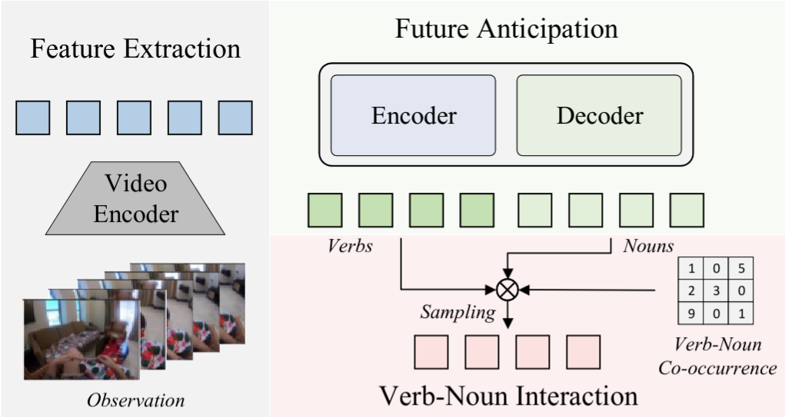

## QueryMamba: A Mamba-Based Encoder-Decoder Architecture with a Statistical Verb-Noun Interaction Module for Video Action Forecasting @ Ego4D Long-Term Action Anticipation Challenge 2024

###### Zeyun Zhong, Manuel Martin, Frederik Diederichs and Juergen Beyerer

<div style="text-align:center">

</div>


## Installation

```bash
conda install -c nvidia cuda-toolkit
```

```bash
conda env create -f environment.yaml python=3.9
conda activate mamba
```

## Prepare data

### Video features
This repo works on pre-extracted video features. You can download official ego4d features [here](https://ego4d-data.org/docs/data/features/) or extract features by yourself.

### Video features to clip features
Since a clip is much shorter than an entire video, we convert video features to clip features for faster I/O.
```bash
python tools.ego4d_video_to_clip_features.py
```

### Generate action taxonomy and ground-truth annotations
We define action taxonomy as dictionary with (verb_label, noun_label) as the keys. 
The action taxonomy looks like:
```python
{
    "0,10": {
        "verb": "adjust_(regulate,_increase/reduce,_change)", 
        "noun": "bag_(bag,_grocery,_nylon,_polythene,_pouch,_sachet,_sack,_suitcase)", 
        "freq": 28, 
        "action_label": 0
    },
    ...,
}
```
Each annotation file contains a `Lx15` tensor, where `L` denotes the number of frames. 15 is the maximal number of labels for each frame. 
For instance, if a frame has the annotation `[98,11,101,-1,-1,-1,-1,-1,-1,-1,-1,-1,-1,-1,-1]`, then it has three "true" labels: 98, 11, and 101.

You can generate both action taxonomy and gt files with:
```bash
python tools.create_ego4d_gt_files.py
```

### Data structure
After setting up features and gt files, your data structure may look like this:
```
Dataset root path (e.g., /home/user/datasets)
├── ego4d
│   └── version
│       │── annotations
│       │   └── action_taxonomy.json
│       │   └── fho_lta_train.json
│       │   └── ...
│       │── action_anno_perfram
│       │   └── clip_uid.pt
│       │── noun_anno_perfram
│       │   └── clip_uid.pt
│       │── verb_anno_perfram
│       │   └── clip_uid.pt
│       │── omnivore_video_swinl_clips
│       │   └── clip_uid.pt
```

## Train / Test
All config params are defined in [default_config.py](lta/config/default_config).
```bash
bash expts/train_ego4d_querymamba.sh
# or testing
bash expts/test_ego4d_querymamba.sh
```
